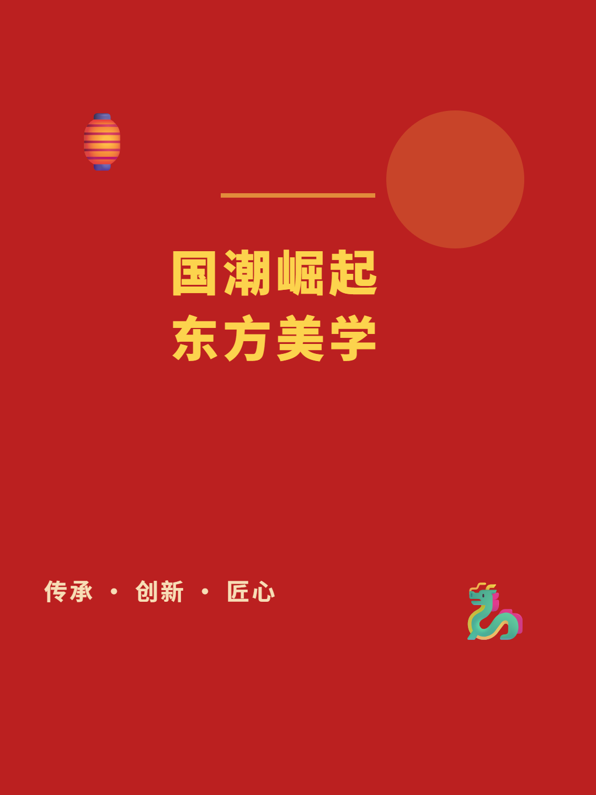
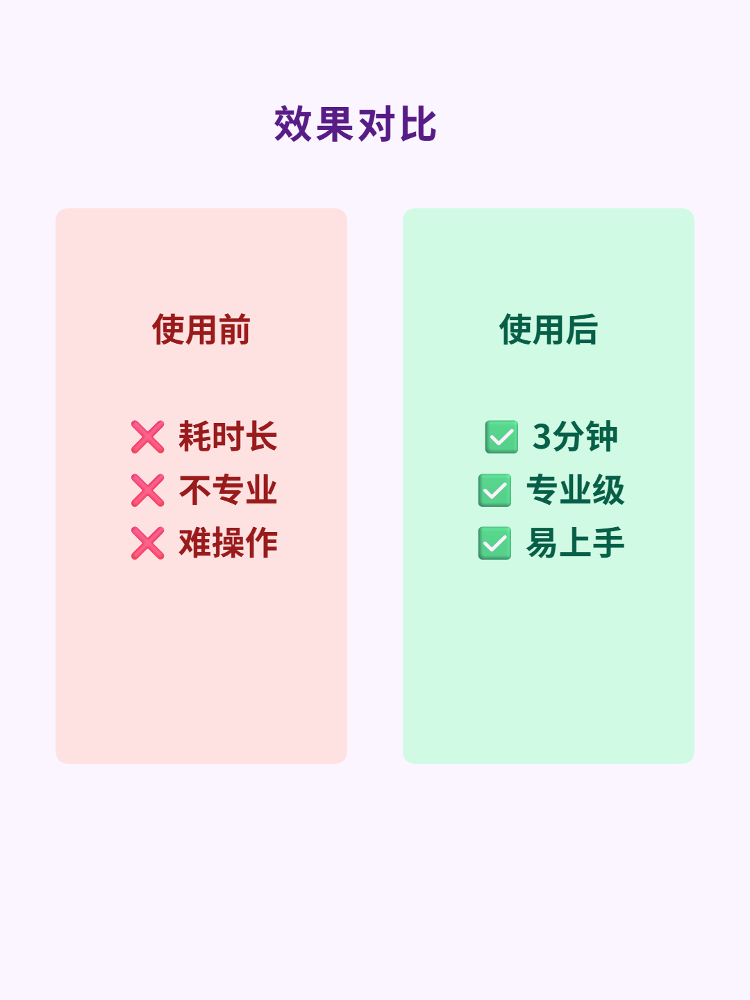
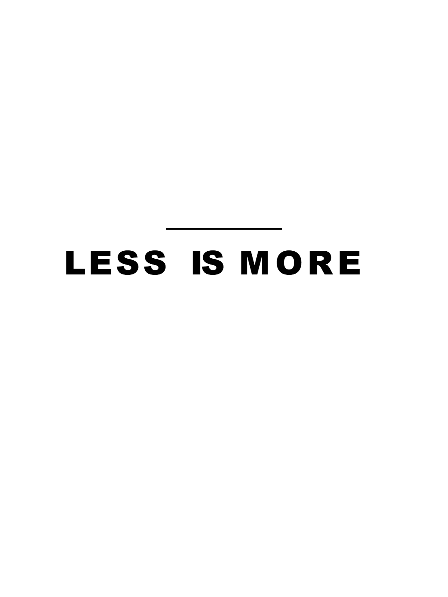

# 封面生成器 Pro 🎨

> 3分钟搞定专业封面 - 强大的在线封面设计工具

## 📸 封面展示

<div align="center">
  
  
</div>

<div align="center">
  
  
</div>

---

一款专为内容创作者打造的在线封面设计工具，支持小红书、抖音、微博等多平台封面快速生成。提供20+精美模板，完整的画布交互编辑功能，让封面设计变得简单高效。

   

---

## ✨ 核心特性

### 🎯 20+ 专业模板
- **基础模板（10个）**：思考型、对话框型、情绪型、建议型、故事型、数据型、对比型、清单型、引用型、极简型
- **高级模板（10个）**：渐变潮流、3D卡片、赛博朋克、复古Y2K、杂志封面、科技未来、手绘涂鸦、玻璃态、孟菲斯、国潮风

### 🖱️ 全交互式画布编辑器
- **拖拽移动**：直接在画布上拖拽元素到任意位置
- **自由缩放**：8个方向的缩放控制点，等比/自由缩放
- **任意旋转**：360°旋转控制，精确到每个角度
- **实时文本编辑**：双击文本即可编辑内容
- **多元素选择**：支持单选和多选操作
- **对齐功能**：左对齐、右对齐、上对齐、下对齐、水平居中、垂直居中

### ⌨️ 快捷键支持
- `Delete/Backspace` - 删除选中元素
- `Ctrl+D` - 复制选中元素
- `↑/↓/←/→` - 微调元素位置（每次移动1px）
- `Ctrl+↑/↓/←/→` - 快速移动（每次移动10px）
- `ESC` - 取消选择

### 🎨 丰富的元素类型
- **文字**：自定义字体、大小、颜色、行高、字间距、对齐方式
- **形状**：矩形、圆形、星形、三角形，支持圆角、描边、填充色
- **Emoji**：海量表情符号库，可调整大小和位置
- **配色**：精选渐变色方案，一键应用背景色

### 📱 多平台尺寸支持
- **小红书**：1080 × 1440
- **抖音**：1080 × 1920
- **微博**：1200 × 628
- **微信公众号**：900 × 500
- **B站**：1920 × 1080
- **Instagram**：1080 × 1080

### 💾 导出功能
- 支持 **PNG**、**JPEG**、**WebP** 三种格式
- 自定义导出质量
- 完整渲染所有元素（包括旋转、透明度、层级）
- 一键下载高清封面

### 🎛️ 属性面板
- **位置控制**：精确设置 X、Y 坐标
- **尺寸控制**：精确设置宽度、高度
- **旋转角度**：0-360° 任意调整
- **透明度**：0-100% 透明度控制
- **图层管理**：Z-index 层级调整
- **元素锁定**：防止误操作
- **可见性控制**：显示/隐藏元素

### 📐 图层管理
- 可视化图层列表
- 拖拽调整层级顺序
- 快速选择/隐藏/锁定图层
- 图层重命名

---

## 🚀 快速开始

### 环境要求
- Node.js 16+
- npm 或 yarn

### 安装步骤

```bash
# 克隆项目
git clone https://github.com/your-repo/cover-generator-pro.git
cd cover-generator-pro

# 安装依赖
npm install

# 启动开发服务器
npm run dev

# 构建生产版本
npm run build
```

### 访问应用
开发模式下，应用将运行在 `http://localhost:3000`

---

## 📖 使用指南

### 1. 选择模板
在左侧模板面板中选择适合您内容风格的模板，系统会自动加载模板布局。

### 2. 编辑内容
- **编辑文字**：双击画布中的文字元素，直接修改内容
- **调整位置**：拖拽元素到目标位置
- **调整大小**：拖拽元素四角的控制点缩放
- **旋转元素**：拖拽顶部的旋转控制点

### 3. 添加元素
- 点击左侧 **文字** 标签页添加文本
- 点击 **元素** 标签页添加形状和 Emoji
- 点击 **配色** 标签页更改背景色

### 4. 精细调整
- 在右侧 **属性** 面板中精确调整选中元素的各项属性
- 使用 **图层** 面板管理元素层级关系

### 5. 导出下载
- 选择目标平台尺寸（左下角导出面板）
- 选择导出格式（PNG/JPEG/WebP）
- 点击 **下载封面图片** 按钮

---

## 🛠️ 技术栈

### 前端框架
- **React 18.3.1** - 用户界面构建
- **TypeScript 5.5.3** - 类型安全的开发体验
- **Vite 5.4.2** - 快速的开发构建工具

### 状态管理
- **Zustand 5.0.2** - 轻量级状态管理

### UI 框架
- **Tailwind CSS 3.4.1** - 实用优先的 CSS 框架
- **Lucide React 0.469.0** - 精美的图标库

### 画布渲染
- **Canvas API** - 原生 HTML5 Canvas 渲染
- 自定义交互式画布组件 `AdvancedCanvas`

---

## 📁 项目结构

```
cover-generator-pro/
├── src/
│   ├── components/          # React 组件
│   │   ├── AdvancedCanvas.tsx    # 高级交互式画布
│   │   ├── TemplateSelector.tsx  # 模板选择器
│   │   ├── PropertyPanel.tsx     # 属性编辑面板
│   │   ├── LayerPanel.tsx        # 图层管理面板
│   │   ├── ExportPanel.tsx       # 导出设置面板
│   │   ├── Header.tsx            # 应用头部
│   │   └── editors/              # 编辑器组件
│   │       ├── TextEditor.tsx    # 文字编辑器
│   │       ├── ColorEditor.tsx   # 配色编辑器
│   │       └── ElementEditor.tsx # 元素编辑器
│   ├── data/                # 静态数据
│   │   ├── templates.ts     # 模板定义
│   │   ├── colorSchemes.ts  # 配色方案
│   │   └── emojis.ts        # Emoji 库
│   ├── store/               # 状态管理
│   │   └── editorStore.ts   # 编辑器状态
│   ├── types/               # TypeScript 类型定义
│   │   └── index.ts
│   ├── App.tsx              # 应用主组件
│   ├── main.tsx             # 应用入口
│   └── index.css            # 全局样式
├── public/                  # 静态资源
├── package.json             # 依赖配置
├── tsconfig.json            # TypeScript 配置
├── tailwind.config.js       # Tailwind 配置
├── vite.config.ts           # Vite 配置
└── README.md                # 项目文档
```

---

## 🎯 核心功能实现

### 交互式画布（AdvancedCanvas）
采用纯 Canvas API 实现，核心功能包括：
- 坐标转换系统（画布坐标 ↔ 显示坐标）
- 碰撞检测（点击选择、框选）
- 拖拽系统（元素移动、缩放、旋转）
- 文本编辑系统（双击编辑、实时渲染）
- 右键菜单系统
- 选择框渲染（控制点、旋转手柄）

### 状态管理（Zustand）
使用 Zustand 管理全局状态：
- 画布配置（尺寸、背景色）
- 元素列表（文字、形状、Emoji）
- 选中状态（单选/多选）
- 历史记录（撤销/重做）

### 导出系统（ExportPanel）
- 创建临时 Canvas 进行高精度渲染
- 支持所有元素类型的完整渲染
- 精确处理旋转、透明度、层级
- 多格式导出（PNG/JPEG/WebP）

---

## 🎨 模板系统

每个模板包含：
- **基础信息**：名称、类型、描述、标签
- **布局配置**：背景色、元素列表
- **预设元素**：文字、形状、Emoji 及其属性

### 模板示例
```typescript
{
  id: 'gradient',
  name: '渐变潮流',
  type: 'gradient',
  emoji: '🌈',
  description: '渐变色彩，适合时尚、潮流、创意内容',
  tags: ['渐变', '时尚', '潮流'],
  layout: {
    backgroundColor: '#FF6B9D',
    elements: [
      // 元素定义...
    ]
  }
}
```

---

## 🤝 贡献指南

欢迎提交 Issue 和 Pull Request！

### 开发流程
1. Fork 本仓库
2. 创建特性分支 (`git checkout -b feature/AmazingFeature`)
3. 提交更改 (`git commit -m 'Add some AmazingFeature'`)
4. 推送到分支 (`git push origin feature/AmazingFeature`)
5. 开启 Pull Request

### 代码规范
- 遵循 TypeScript 严格模式
- 使用 ESLint 进行代码检查
- 保持组件的单一职责
- 添加必要的注释

---

## 📝 更新日志

### v1.0.0 (2024-10-17)
- ✨ 首次发布
- ✅ 20个精美模板
- ✅ 完整的交互式画布编辑功能
- ✅ 多平台尺寸支持
- ✅ PNG/JPEG/WebP 导出
- ✅ 属性面板和图层管理
- ✅ 快捷键支持


## 👨‍💻 关于作者

**WUTONG开源**

- 微信：tkzypt
- QQ：1622068165

如果这个项目对您有帮助，欢迎 Star ⭐ 支持！

---

## 🙏 致谢

- [React](https://react.dev/) - 强大的前端框架
- [Vite](https://vitejs.dev/) - 快速的构建工具
- [Tailwind CSS](https://tailwindcss.com/) - 优秀的 CSS 框架
- [Lucide](https://lucide.dev/) - 精美的图标库
- [Zustand](https://zustand-demo.pmnd.rs/) - 简洁的状态管理

---

## 📮 联系方式

有任何问题或建议，欢迎联系：
- 微信：tkzypt
- QQ：1622068165
- GitHub Issues: [提交问题](https://github.com/your-repo/cover-generator-pro/issues)

---

**让封面设计变得简单高效，从封面生成器 Pro 开始！** 🚀

---

## ☕ 打赏支持

如果这个项目帮到了您，可以请作者喝杯咖啡 ☕

<div align="center">
  
  
  <p><strong>微信</strong>&nbsp;&nbsp;&nbsp;&nbsp;&nbsp;&nbsp;&nbsp;&nbsp;&nbsp;&nbsp;&nbsp;&nbsp;&nbsp;&nbsp;&nbsp;&nbsp;&nbsp;&nbsp;&nbsp;&nbsp;&nbsp;&nbsp;&nbsp;&nbsp;&nbsp;&nbsp;&nbsp;&nbsp;&nbsp;&nbsp;&nbsp;&nbsp;&nbsp;&nbsp;&nbsp;&nbsp;&nbsp;&nbsp;&nbsp;&nbsp;<strong>支付宝</strong></p>
</div>
